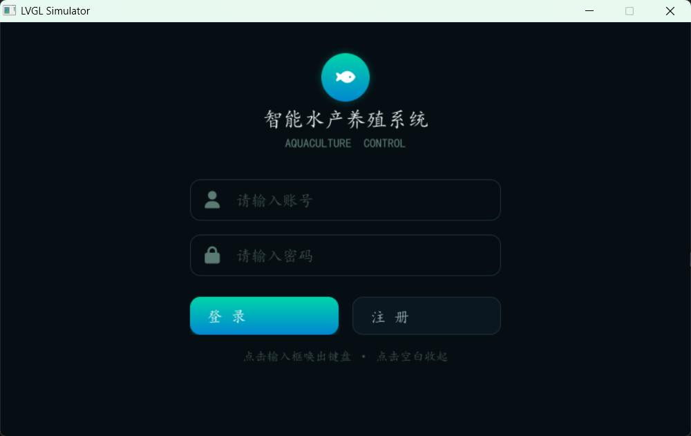
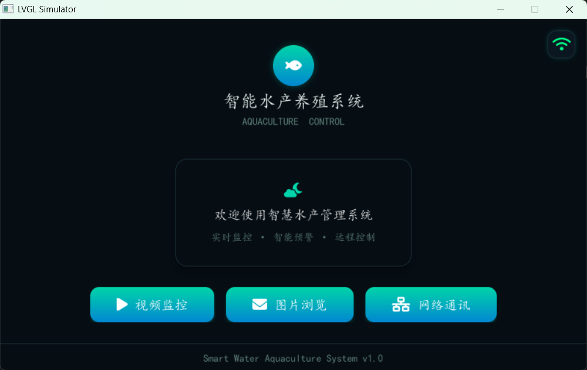
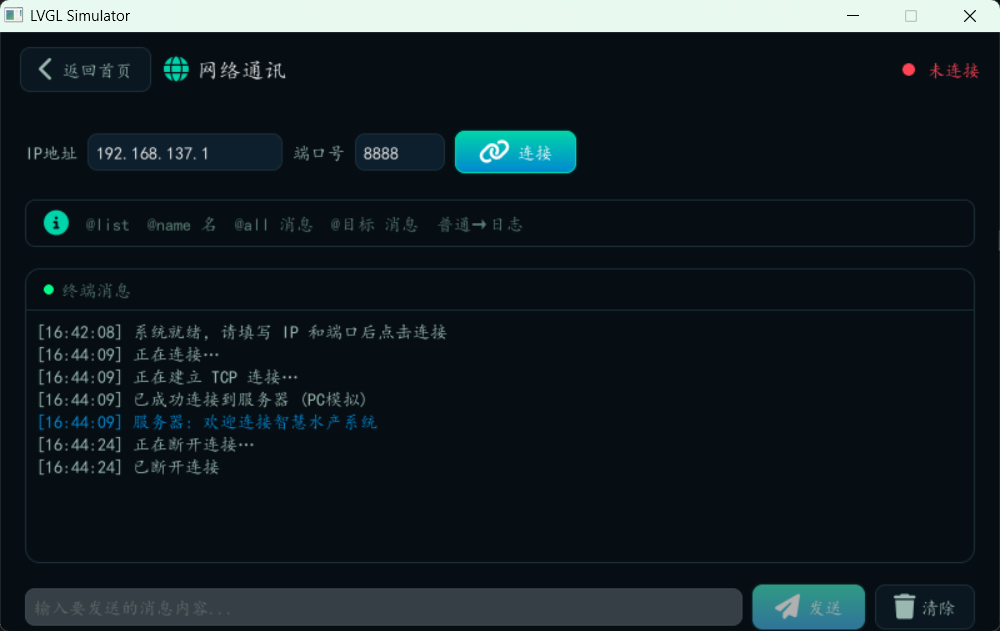

# 智慧水产养殖系统 — LVGL v9 UI

基于 **LVGL v9** 的智慧水产养殖管理系统，支持 PC 模拟（SDL2）和 **GEC6818 ARM Linux** 嵌入式板卡双平台运行。

---

## 功能模块

| 模块 | 说明 |
|------|------|
| 登录/注册 | 账号密码验证、注册、成功弹窗动画 |
| 首页仪表盘 | Logo、快捷入口按钮、WiFi 网络状态指示器 |
| 视频监控 | mplayer 视频播放、滑动切换视频、封面预览、进度条 |
| 图片浏览 | 文件夹自动扫描、滑动切换、圆点指示器、缓存预加载 |
| 网络通讯 | TCP Socket 客户端、收发消息、在线终端显示 |
| 拼音输入法 | 集成 lv_100ask_pinyin_ime，支持中文拼音输入 |

---

## 截图



*登录页面 & 首页仪表盘 — WiFi 状态指示灯（右上角，呼吸动画）*



*视频监控（mplayer 嵌入播放 + 滑动切换）& 图片浏览（文件夹扫描 + 缓存预加载）*



*网络通讯页面（Socket 收发 + 终端消息区）& 拼音中文输入键盘*

---

## 目录结构

```
src/ui-smart-water/
├── ui.h / ui.c                  ← 入口，屏幕创建 + 导航
├── preview/                     ← HTML 预览文件
├── fonts/                       ← SIMKAI.TTF + FA6-Free-Solid-900.otf
├── images/                      ← 图片资源（.png）
└── pages/
    ├── app_fonts.c/h            ← FreeType 字体加载
    ├── app_actions.c/h          ← 业务逻辑回调（登录、视频、网络、WiFi）
    ├── app_keyboard.c/h         ← 拼音输入法键盘
    ├── app_popup.c/h            ← Toast 弹窗
    ├── register-page/           ← 登录 + 注册页面
    ├── home-page/               ← 首页仪表盘
    ├── video-page/              ← 视频监控页面
    ├── gallery-page/            ← 图片浏览页面
    ├── network-page/            ← 网络通讯页面
    └── pinyin-ime/              ← lv_100ask_pinyin_ime（适配版）
```

---

## 编译运行

### PC（Windows / Linux）

```bash
mkdir build && cd build
cmake .. -DLV_USE_FREETYPE=ON
cmake --build .
./bin/main
```

预置账号：`a` / `a`

### GEC6818 ARM Linux 板卡

交叉编译后将 `bin/main` 和字体文件部署到板卡：

```bash
# 部署
cp bin/main /root/
cp src/ui-smart-water/fonts/SIMKAI.TTF /root/
cp src/ui-smart-water/fonts/FA6-Free-Solid-900.otf /root/

# 视频文件放在 /root/videos/
# 图片文件放在 /root/images/

# 运行
cd /root && ./main
```

> **注意**：板子编译时 `app_fonts.c` 中字体路径会自动切换为 `./SIMKAI.TTF` 和 `./FA6-Free-Solid-900.otf`。

---

## 设计风格

**Ocean / Aquatic 暗色主题**

| 属性 | 色值 | 用途 |
|------|------|------|
| 背景 | `#060E14` | 页面主背景 |
| 卡片 | `#0A1620` | 容器、面板 |
| 主色调 | `#00D4AA` | 按钮渐变、强调 |
| 辅色调 | `#0288D1` | 渐变、接收消息 |
| 金色 | `#D4A017` | 键盘按键文字 |
| 文字主色 | `#E0E0E0` | 标题 |
| 文字辅色 | `#9AB8B0` | 正文 |
| 文字弱色 | `#5A7A72` | 提示 |

**字体**：楷体（SIMKAI.TTF）+ Font Awesome 6 图标

---

## 页面跳转动画

| 方向 | 动画 | 时长 |
|------|------|------|
| 进入子页面 | 左滑推入 | 350ms |
| 返回上层 | 右滑退出 | 350ms |
| 登录成功 | 淡入 | 400ms |

---

## 网络通讯

TCP 客户端直接集成在 LVGL 内，无需额外进程：

```
LVGL 主线程
  ├─ 点「连接」→ socket() → connect() → pthread recv_thread
  ├─ 点「发送」→ write(sock, msg)
  ├─ recv_thread → lv_async_call → 消息区更新
  └─ 点「断开」→ shutdown() → recv_thread 退出
```

可用指令（发送到服务端）：

| 指令 | 说明 |
|------|------|
| `@list` | 查看在线用户列表 |
| `@name 新名字` | 修改自己的名字 |
| `@all 消息` | 广播消息给所有人 |
| `@目标 消息` | 发送给指定用户 |
| 普通消息 | 服务端日志记录 |

---

## License

MIT
