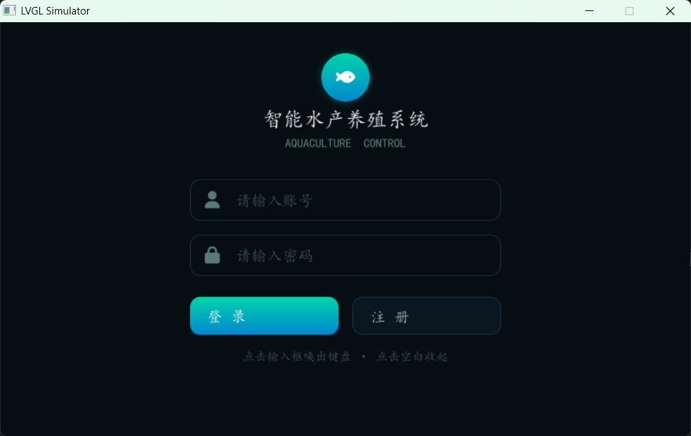
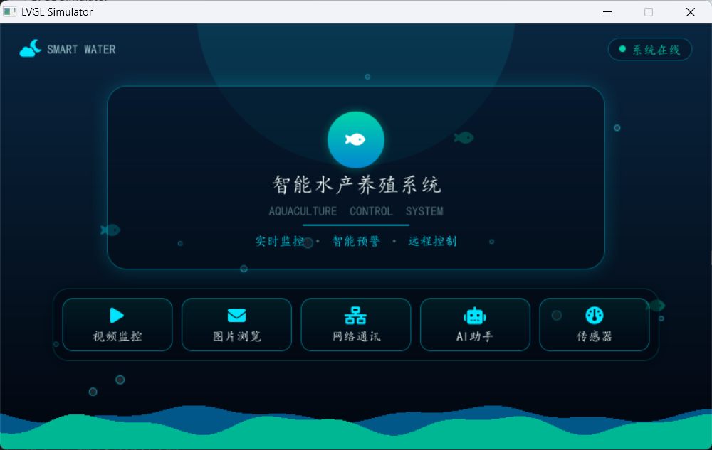
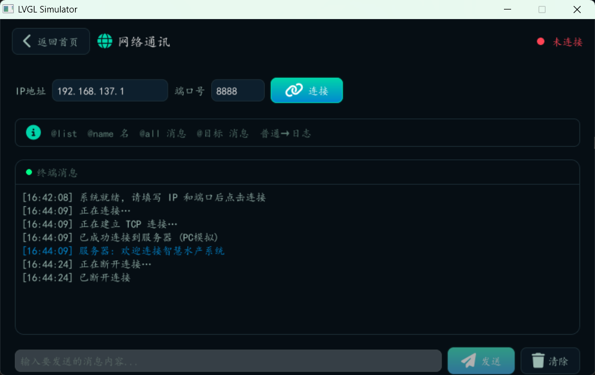
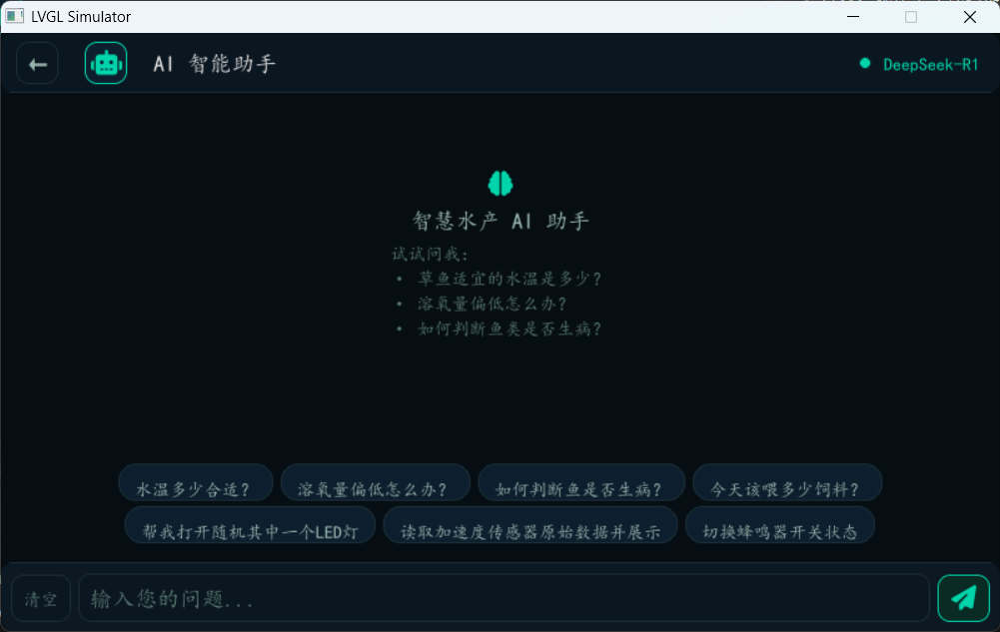
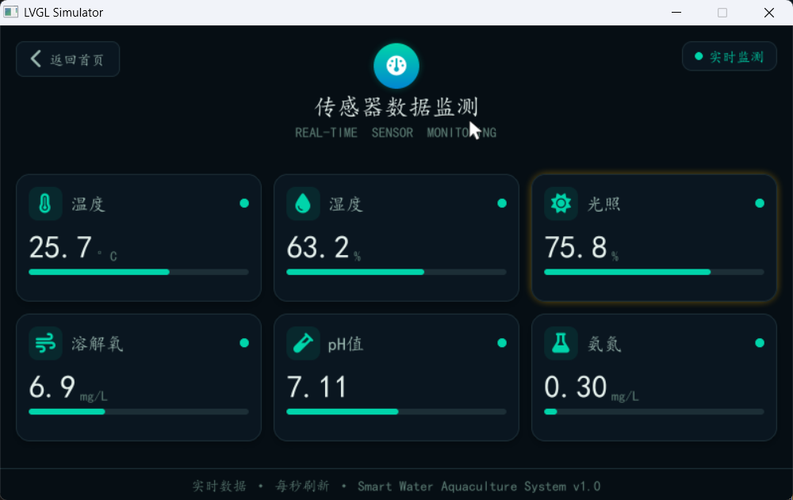

# 智慧水产养殖系统 — LVGL v9 + Qwen2.5:7b AI

> 🐟 基于 LVGL v9 的嵌入式智慧水产养殖管理系统。集成 **Qwen2.5:7b 原生 Function Calling**，
> 10 个硬件/传感器工具，真正实现"自然语言 → 控制板载 LED/蜂鸣器 + 读取水质传感器
> + 1h 预测趋势分析 + 智能推荐投喂/增氧方案"的完整 AI 闭环。

基于 **LVGL v9** 的智慧水产养殖管理系统，支持 PC 模拟（SDL2）和 **GEC6818 ARM Linux** 嵌入式板卡双平台运行。

### 🧠 AI 核心能力

| 能力 | 实现方式 |
|------|---------|
| **水质环境自动评价** | `read_water_quality` — 一次性读 6 路传感器, 对照水产参考区间, 精准评价 |
| **养殖/设备运维问答** | Qwen2.5:7b 水产养殖知识 + `analyze_environment` 趋势/预测/相关性 |
| **日志故障诊断** | `analyze_environment` — 1h 预测 + 趋势方向 + 异常剔除数, 预判传感器故障 |
| **投喂/增氧智能方案** | 基于实时水温 + 溶氧 + pH + 氨氮, 结合养殖参考表, 推荐最优投喂率+增氧时长 |

### 🔧 硬件控制

| 工具 | 硬件 |
|------|------|
| `control_led / random_led_on` | D7~D10 LED (sysfs `led1~4`) |
| `control_buzzer / toggle_buzzer` | GPIO78 蜂鸣器 (软件状态追踪) |
| `read_button` | GPIO28 K2 按键 (按下=0) |
| `read_acceleration` | MMA8653 I2C 加速度计 (±2g, ioctl EVIOCGABS) |

### 📡 数据架构

```
MQTT → edge_engine → CSV 持久化 → 快照 + 回归 + 1h 预测 + 皮尔逊相关性
  ↑ 写入                              ↓ 读取 (所有数据源一致)
app_mqtt.c               AI 工具 / 传感器页面 / 趋势报表页
```

---

## 功能模块

| 模块 | 说明 |
|------|------|
| 登录/注册 | 账号密码验证、注册、成功弹窗动画 |
| **首页仪表盘** | **海洋沉浸式导航枢纽 — canvas 双层波浪、气泡上浮、鱼影游动、玻璃欢迎卡、霓虹导航坞、WiFi 指示器、离屏暂停优化** |
| **传感器数据监测** | **6 路传感器实时展示 + MQTT 真数据 + 边缘引擎持久化, 三态告警配色, 光照特效** |
| **养殖环境趋势报表** | **6 路 Faded area 折线图 + 线性回归预测 + 异常剔除 + 传感器相关性** |
| **AI 智能助手** | **Qwen2.5:7b 原生 FC — 10 个硬件/传感器工具 — 水质评价/故障诊断/投喂增氧方案** |
| 视频监控 | mplayer 视频播放、滑动切换、封面预览、进度条 |
| 图片浏览 | 文件夹扫描、滑动切换、圆点指示器、缓存预加载 |
| 网络通讯 | TCP Socket 客户端、收发消息、在线终端 |
| 拼音输入法 | lv_100ask_pinyin_ime，中文拼音输入 |

---

## 最新更新 (2026-07)

### 首页重构 — 海洋沉浸式导航枢纽

全新设计的首页，深海蓝 + 青色霓虹主题，多项动态视觉效果：

| 元素 | 实现方式 |
|------|---------|
| 深海渐变背景 | 垂直渐变 `#0A2640` → `#02060E` + 顶部青色光晕 |
| 玻璃欢迎卡 | 半透明 bg + 渐变 + 青色边框 + 50px 外发光阴影 |
| 双层波浪 | `lv_canvas` 800×80 ARGB8888，40ms 定时器直接写像素重绘正弦波（后层蓝 + 前层青，反向流动） |
| 气泡 ×12 | `lv_obj` 小圆 + `lv_anim` 上浮 + 淡入淡出，错峰参数表 |
| 鱼影 ×3 | fa-fish 字形 label + `lv_anim` 横移 + sin 摆尾，不同深度/速度/颜色/透明度 |
| 导航药丸 ×5 | 5 个玻璃质感药丸（视频/图片/网络/AI/传感器），悬停上浮发光 + 点击回调 |
| 网络状态指示 | 顶部状态药丸，颜色随 WiFi 检测结果变化（绿/黄/红） |
| 离屏暂停优化 | `LV_EVENT_SCREEN_LOAD/UNLOAD` 生命周期管理，离开首页自动暂停波浪/WiFi 定时器 |

### 传感器数据监测页

6 路水产关键传感器，3 行 × 2 列卡片网格，与现有页面风格统一（海洋深色主题）：

| 传感器 | 单位 | 图标 | 安全带 | 告警 |
|--------|------|------|--------|------|
| 温度 | °C | fa-temperature-half | 18–28 | <15 / >32 |
| 湿度 | % | fa-droplet | 40–80 | <30 / >90 |
| 光照 | % | fa-sun | 20–90 | 随值发光（值越大卡片暖黄光晕越亮） |
| 溶解氧 | mg/L | fa-wind | 5–20 | <3 |
| pH值 | — | fa-vial | 6.5–8.5 | <6 / >9 |
| 氨氮 | mg/L | fa-flask | <0.5 | >1.0 |

- **三态告警配色**：正常青绿 / 预警黄 / 告警红，数值越限时边框、图标、状态点、进度条、数值颜色同步变化
- **MQTT 真数据**：`app_mqtt.c` 订阅传感器 JSON，Paho 回调 → `app_action_sensor_set()` → 1 秒刷新；未收到时卡片显示 `"--"`
- **PC 降级**：PC 编译不依赖 Paho 库，`app_mqtt_init()` 退化为空桩，传感器页不显示数据

---

### MQTT 传感器数据接入

GEC6818 板卡通过 **Eclipse Paho MQTT C** 库订阅传感器数据，零模拟：

```
MQTT Broker (broker.emqx.io:1883)
    ↑ publish {"temp":26.3,"humi":65.0,"light":72.0,"do":6.5,"ph":7.20,"nh3n":0.30}
    │
[Sensor Node / ESP32]
    │
    ↓ subscribe "fhb/gec6818/sensors"
[GEC6818 — LVGL App]
    ├─ app_mqtt_init() → connect + subscribe
    ├─ Paho 内部线程 → msg_arrived() → JSON 轻量解析 → app_action_sensor_set()
    └─ sensor_page 1s 定时器 → app_action_sensor_read() → 显示
```

**配置**（`app_mqtt.c` 顶部宏）：

```c
#define MQTT_BROKER_ADDR  "mqtt://broker.emqx.io:1883"
#define MQTT_CLIENT_ID    "fhb_gec6818_lvgl_001"
#define MQTT_TOPIC        "fhb/gec6818/sensors"
```

**JSON 消息格式**（6 个键名，缺字段也行）：

```json
{"temp":26.3,"humi":65.0,"light":72.0,"do":6.5,"ph":"7.20","nh3n":0.30}
```

**ARM 编译**（需先交叉编译 Paho 库 → `paho-install/`，放到 `src/ui-smart-water/` 下）：

```bash
cmake -B build -DCMAKE_TOOLCHAIN_FILE=./user_cross_compile_setup.cmake -DUSE_MQTT=ON
cmake --build build -j$(nproc)
```

PC 编译不需要 Paho：`app_mqtt.c` 在 `USE_MQTT=OFF` 时编译为空，`app_mqtt_init()` 直接返回 false。

MQTT 参考实现见 `src/gec6818_mqtt/`（含 pub/sub demo、交叉编译脚本）。

---

## 截图



*登录页面 & 首页仪表盘 — 海洋沉浸式导航枢纽*



*视频监控（mplayer 嵌入播放 + 滑动切换）& 图片浏览（文件夹扫描 + 缓存预加载）*



*网络通讯页面（Socket 收发 + 终端消息区）& 拼音中文输入键盘*



*AI 智能助手 — DeepSeek-R1:7B 大模型对话、思考过程可折叠、头像呼吸灯光晕、快捷提问按钮*



*传感器数据监测页 — 6 路传感器实时展示、三态告警配色、光照卡片发光特效*

---

## 目录结构

```
src/ui-smart-water/
├── ui.h / ui.c                  ← 入口, 屏幕创建 + 导航
├── preview/                     ← HTML 预览文件
├── fonts/                       ← SIMKAI.TTF (楷体) + FA6-Free-Solid-900.otf (图标)
├── images/                      ← 图片资源 (.png)
├── libs/cjson/                  ← cJSON 单文件库 (v1.7.18 · 无条件编译)
├── edge/                        ← 边缘端数据预处理引擎
│   ├── edge_engine.c/h          ← worker 线程: 去重/异常过滤/CSV 持久化/快照+历史环
│   ├── edge_analysis.c/h        ← 纯数学: Pearson 相关 + 最小二乘回归 + 预测 + 当日汇总
│   ├── edge_store.c/h           ← eMMC CSV 读写 + 分析缓存
│   └── sensor_range.h           ← 6 路传感器索引枚举 + 物理量程表
└── pages/
    ├── app_fonts.c/h            ← FreeType 字体加载
    ├── app_actions.c/h          ← 业务回调; AI 分区 4: 薄壳 init/send/stop + 事件适配
    ├── app_keyboard.c/h         ← 拼音输入法键盘
    ├── app_popup.c/h            ← Toast 弹窗
    ├── app_mqtt.c/h             ← MQTT 传感器订阅 (Paho C · ARM 板)
    ├── register-page/           ← 登录 + 注册页面
    ├── home-page/               ← 首页 (海洋沉浸式导航枢纽)
    ├── sensor-page/             ← 传感器数据监测页
    ├── trend-page/              ← 养殖环境趋势报表页
    ├── video-page/              ← 视频监控页面
    ├── gallery-page/            ← 图片浏览页面
    ├── network-page/            ← 网络通讯页面
    ├── ai-chat-page/            ← AI 对话
    │   ├── ai_agent.c/h         ← Agent: worker 线程 + HTTP + tool_calls 闭环
    │   ├── ai_tools.c/h         ← 工具注册表: 10 个硬件/传感器工具 (数据驱动)
    │   ├── ai_hardware.c/h      ← 板卡硬件层: LED/蜂鸣器/按键/加速度计 (sysfs/GPIO/I2C)
    │   ├── ai_chat_page.c/h     ← UI: 聊天气泡 + 思考面板 + 输入框 + 快捷提问
    │   ├── http_client.c/h      ← POSIX socket HTTP/1.1 (select 超时, ARM 适配)
    │   └── README.md            ← AI 模块完整技术手册 (13 章)
    └── pinyin-ime/              ← lv_100ask_pinyin_ime (适配版)

src/gec6818_ai_fc/               ← AI-FC 参考骨架 (独立 PC 测试入口 + Makefile)
```

---

## 编译运行

### PC（Windows / Linux）

```bash
mkdir build && cd build
cmake .. -DLV_USE_FREETYPE=ON
cmake --build .
cd bin && ./main
```

预置账号：`a` / `a`

### GEC6818 ARM Linux 板卡

交叉编译后将 `bin/main` 和字体文件部署到板卡：

```bash
# 部署
cp bin/main /root/
cp src/ui-smart-water/fonts/SIMKAI.TTF /root/
cp src/ui-smart-water/fonts/FA6-Free-Solid-900.otf /root/

# 视频文件放在 /root/videos/
# 图片文件放在 /root/images/

# 运行
cd /root && ./main
```

> **注意**：板子编译时 `app_fonts.c` 中字体路径会自动切换为 `/root/fonts/SIMKAI.TTF` 和 `/root/fonts/FA6-Free-Solid-900.otf`。

> **ARM 兼容提示**：首页动画在 GEC6818 上已长期稳定运行验证。板子的 fbdev 帧缓冲不兜底越界坐标，代码中已避免了 `transform_scale` 在 label 上的使用（已知会在 ARM 板上段错误），所有动画均使用 `lv_anim` + `lv_canvas`（安全）实现。

---

## 设计风格

### 首页 — 深海蓝 + 青色霓虹（旗舰沉浸主题）

| 属性 | 色值 | 用途 |
|------|------|------|
| 顶部 | `#0A2640` | 深蓝（模拟水面光） |
| 底部 | `#02060E` | 近黑（深海） |
| 霓虹 | `#00E5FF` | 边框、分割线、图标、悬浮发光 |
| 青绿 | `#00D4AA` | 渐变色、健康状态 |
| 蓝色 | `#0288D1` | 渐变色、后层波浪 |
| 文字 | `#E6F2EE` | 标题、正文 |

### 子页面 — Ocean / Aquatic 暗色主题

| 属性 | 色值 | 用途 |
|------|------|------|
| 背景 | `#060E14` | 页面主背景 |
| 卡片 | `#0A1620` | 容器、面板 |
| 主色调 | `#00D4AA` | 按钮渐变、强调 |
| 辅色调 | `#0288D1` | 渐变、接收消息 |
| 文字主色 | `#E0E0E0` | 标题 |
| 文字辅色 | `#9AB8B0` | 正文 |
| 文字弱色 | `#5A7A72` | 提示 |

**字体**：楷体（SIMKAI.TTF）+ Font Awesome 6 图标（FA6-Free-Solid-900.otf）

---

## AI 智能助手 — Qwen2.5:7b 原生 Function Calling

通过 Ollama API 调用 **Qwen2.5:7b**，原生 `tool_calls` JSON 协议，**真正控制板载硬件 + 读取水质传感器**。三层架构，Agent/Tools 层不依赖 LVGL，可独立编译测试。

```
用户输入 → ai_chat_page (UI · 不变)
              → app_action_ai_send()          [app_actions.c · 薄壳]
                 → ai_agent_send()             [ai_agent.c · worker 线程]
                    → Ollama POST /api/chat    [带 tools schema]
                    ← model 返回 tool_calls
                    → ai_tools_dispatch()      [ai_tools.c · 10 个工具]
                       → ai_execute_action()   [ai_hardware.c · 真实 GPIO/LED/I2C]
                       → edge_engine_get_latest [6 路水质快照]
                       → edge_engine_get_analysis [1h 预测 + 相关性]
                    ← tool 结果回传模型
                    ← 最终回复
                    → lv_async_call → AI 气泡
```

| 功能 | 说明 |
|------|------|
| **原生 FC 闭环** | Qwen2.5 输出标准 `tool_calls` JSON → C 端解析 → 执行硬件 → 结果回传模型 (最多 3 轮) |
| **10 个工具** | 全 6 路水质/趋势预测/LED×4/蜂鸣器/按键/加速度 |
| **数据精度** | 传感器值按 `g_sensor_phys.dec` 四舍五入, 与传感器页/趋势页完全一致 |
| 思考过程 | `<think>` 标签自动拆分, 工具调用可视化 |
| 对话历史 | 环形缓冲 100 轮, 含 assistant tool_calls + tool 结果 (带 name 字段) |
| 快捷提问 | 7 个 (四大能力 + 问候 + LED + 加速度) |
| PC 模拟桩 | 非 Linux 平台自动退化为模拟回复, 不依赖 Ollama |

**完整技术手册**: `src/ui-smart-water/pages/ai-chat-page/README.md` (13 章, 400 行)

**Ollama 配置** (编译期内置, 运行时可通过 `ai_agent_init()` 覆盖):

```c
#ifdef __linux__
#define OLLAMA_HOST  "192.168.137.1"   // 板子访问 Windows 宿主 Ollama
#else
#define OLLAMA_HOST  "localhost"         // PC 模拟 (不真连)
#endif
#define OLLAMA_PORT  11434
#define OLLAMA_MODEL "qwen2.5:7b"
```

---

## 页面跳转动画

| 方向 | 动画 | 时长 |
|------|------|------|
| 进入子页面 | 左滑推入 | 350ms |
| 返回上层 | 右滑退出 | 350ms |
| 登录成功 | 淡入 | 400ms |

---

## 网络通讯

TCP 客户端直接集成在 LVGL 内，无需额外进程：

```
LVGL 主线程
  ├─ 点「连接」→ socket() → connect() → pthread recv_thread
  ├─ 点「发送」→ write(sock, msg)
  ├─ recv_thread → lv_async_call → 消息区更新
  └─ 点「断开」→ shutdown() → recv_thread 退出
```

可用指令（发送到服务端）：

| 指令 | 说明 |
|------|------|
| `@list` | 查看在线用户列表 |
| `@name 新名字` | 修改自己的名字 |
| `@all 消息` | 广播消息给所有人 |
| `@目标 消息` | 发送给指定用户 |
| 普通消息 | 服务端日志记录 |

---

## License

MIT
